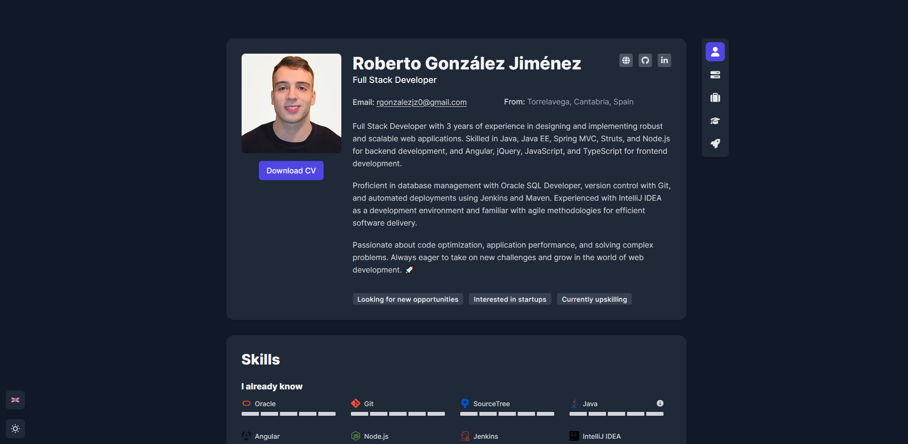

# 🌟 My Portfolio  

Welcome to my personal portfolio! This project showcases my skills, experience, and projects in web development. 🚀  

## 🖥️ Tech Stack  

- **Frontend:** HTML, CSS, JavaScript, Astro  
- **Backend:** Node.js, Express  
- **Styling:** Tailwind CSS

## 🌍 Live Demo  

Check out the live version of my portfolio: [Live Demo](#)  

## 🔥 Features  

- 🎨 **Modern & Responsive Design**: Fully optimized for all devices  
- ⚡ **Fast Performance**: Powered by Astro for a blazing-fast experience  
- 📂 **Projects Showcase**: Browse through my latest work  
- 🌓 **Dark Mode**: Seamless light/dark theme switching  

## 📸 Screenshots  

 

## 🚀 Getting Started  

To run this project locally:  

```sh
# Clone the repo
git clone https://github.com/robergj/portfolio.git  
cd portfolio

#Install dependencies
npm install

#Run in development mode
npm run dev
``` 

📬 Contact

    📧 Email: rgonzalezjz0@gmail.com
    💼 LinkedIn: https://www.linkedin.com/in/robergj/

Feel free to contribute or suggest improvements! 🚀